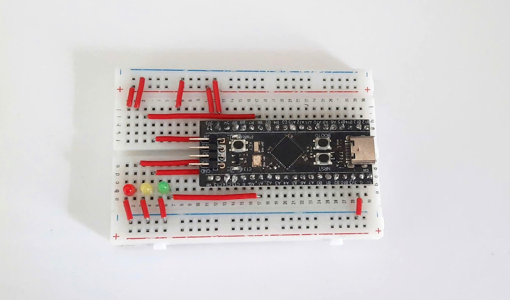
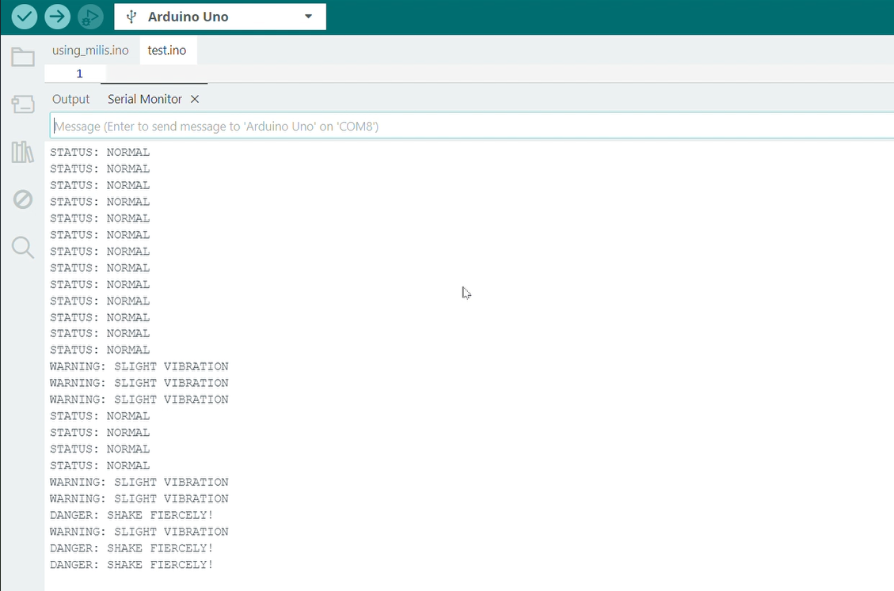

# 🚀 Edge Predictive Maintenance Node (Tiny Machine Learning on STM32)


## 📌 Overview

This project implements a **Real-Time Edge AI Predictive Maintenance System** directly on an STM32F411 microcontroller. By leveraging an MPU6050 6-axis accelerometer and gyroscope, the system monitors physical vibrations and uses a **Random Forest Machine Learning model** embedded inside the MCU to classify the operational state of a machine (Normal, Light Vibration/Anomaly, Hard Shake/Danger) with **zero-latency response**.

Unlike traditional cloud-based IoT systems, this device performs **100% of the inferencing at the edge**, ensuring real-time alerts, high privacy, and low power consumption without requiring an internet connection.

---



---

Video Demo: https://www.youtube.com/watch?v=VqhnAK_nB5U

---
## ✨ Key Features

  * **TinyML Implementation:** A Random Forest classifier trained in Python (`scikit-learn`) and compiled into pure, lightweight C code using `m2cgen` to run on a Cortex-M4 processor.
  * **Zero-Latency Inference:** Utilizes a **Sliding Window algorithm (50% Overlap)** with a window size of 35 samples (\~0.7 seconds at 50Hz) to ensure instant state updates without processing delays.
  * **On-board Feature Extraction:** The STM32 automatically computes statistical features (Mean, Standard Deviation, Max, Min, Range) directly from raw I2C sensor data.
  * **HMI / Visual Alerts:** Real-time physical status indication via an intuitive 3-color LED interface (Green, Yellow, Red) and UART serial logging.

## 🛠️ Hardware Requirements

  * **MCU:** STM32F411CEU6 (Black Pill)
  * **Sensor:** MPU6050 (I2C interface)
  * **Indicators:** 3x LEDs (Green, Yellow, Red) 
  * **Debugger/Programmer:** ST-Link V2
  * **Serial Communication:** CP2102 USB-to-TTL module (for UART logging)

## 🔌 Pin Configuration

| Component | STM32 Pin | Function / Protocol |
| :--- | :--- | :--- |
| **MPU6050** | `PB6` | I2C1 SCL |
| **MPU6050** | `PB7` | I2C1 SDA |
| **USB-to-TTL** | `PA9` | USART1 TX (115200 Baud) |
| **USB-to-TTL** | `PA10` | USART1 RX |
| **Green LED** | `PA1` | GPIO Output (Normal State) |
| **Yellow LED** | `PA2` | GPIO Output (Light Vibration) |
| **Red LED** | `PA3` | GPIO Output (Hard Shake) |
| **Status LED** | `PC13` | On-board LED (System / Error Status) |

## 🧠 System Architecture & Pipeline

1.  **Data Acquisition:** Python script reads raw $Z$-axis acceleration data from STM32 via UART and saves it into CSV files representing different physical states.
2.  **Model Training (PC):** `scikit-learn` trains a Random Forest model extracting 5 time-domain features.
3.  **Model Translation:** `m2cgen` converts the trained model into a lightweight `ai_model.h` header file containing nested `if-else` C logic.
4.  **Edge Deployment:** The STM32 reads I2C data at 50Hz, applies the sliding window, extracts features using ARM math functions (`sqrt`), and feeds them into the generated AI model.
5.  **Action:** The system toggles the corresponding LED and prints the exact status & Standard Deviation value via UART instantly.

## 🚀 How to Run

### 1\. Build and Flash the Firmware

  * Open the project in **STM32CubeIDE**.
  * Ensure `ai_model.h` is placed in the `Core/Inc` directory.
  * Build the project (`Ctrl + B`).
  * Flash the firmware to the STM32 board using an ST-Link.

### 2\. Monitor Serial Output

  * Connect the USB-to-TTL module to your PC.
  * Open a Serial Monitor (e.g., PuTTY, Hercules, or Arduino IDE Serial Monitor).
  * Set the Baud Rate to **115200**.
  * You will see real-time classifications similar to:
    ```text
    STATUS: NORMAL 
    WARNING: SLIGHT VIBRATION    
    DANGER: SHAKE FIERCELY!   
    ```

> **Real-time Monitoring Dashboard on ArduinoIDE:**
> 
> 
> 
> 
> 

----

## 🔮 Future Improvements

While this Proof of Concept (PoC) is fully functional and highly accurate, future iterations of this system could include:

  * **DMA (Direct Memory Access):** Transitioning I2C reading from blocking mode to DMA for ultra-high-speed sampling without CPU overhead.
  * **CMSIS-DSP Integration:** Implementing Fast Fourier Transform (FFT) directly on the ARM Cortex-M4 FPU to analyze frequency-domain features for detecting micro-abrasions in industrial motors.
  * **IoT Gateway Connection:** Interfacing the STM32 with an ESP32 via UART to send predictive maintenance alerts to a Cloud Dashboard (e.g., ThingsBoard).

## 📝 License

This project is open-source and available under the MIT License.

----
